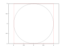

# Rectangle

```cpp
rectangle(x, y, w, h);
```


See result

[](../../../examples/annotations/rectangle/rectangle_1.cpp)

More examples:
    
[](../../../examples/annotations/rectangle/rectangle_2.cpp)  [](../../../examples/annotations/rectangle/rectangle_3.cpp)  [](../../../examples/annotations/rectangle/rectangle_4.cpp)  [](../../../examples/annotations/rectangle/rectangle_5.cpp)
  

The rectangle object can have a border curvature from $0$ to $1$. We can also annotate with text, arrows, polygons, and lines.
  


