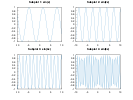
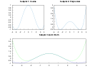
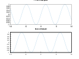
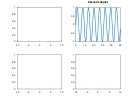

# Subplots

```cpp
subplot(rows, cols, id);
```

Unlike other libraries, subplots uses 0-based indices.


See result

[](../../../../examples/appearance/multiplot/subplot/subplot_1.cpp)

More examples:
    
[](../../../../examples/appearance/multiplot/subplot/subplot_2.cpp)  [](../../../../examples/appearance/multiplot/subplot/subplot_3.cpp)  [](../../../../examples/appearance/multiplot/subplot/subplot_4.cpp)  [](../../../../examples/appearance/multiplot/subplot/subplot_5.cpp)  [](../../../../examples/appearance/multiplot/subplot/subplot_6.cpp)  [](../../../../examples/appearance/multiplot/subplot/subplot_7.cpp)  [](../../../../examples/appearance/multiplot/subplot/subplot_8.cpp)  [](../../../../examples/appearance/multiplot/subplot/subplot_9.cpp)  [](../../../../examples/appearance/multiplot/subplot/subplot_10.cpp)  [](../../../../examples/appearance/multiplot/subplot/subplot_11.cpp)  [](../../../../examples/appearance/multiplot/subplot/subplot_12.cpp)  [](../../../../examples/appearance/multiplot/subplot/subplot_13.cpp)
  


