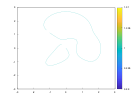
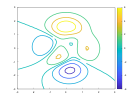
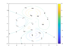

# Contour

```cpp
contour(X, Y, Z);
```


See result

[](https://github.com/alandefreitas/matplotplusplus/blob/master/examples/contour_plots/contour/contour_1.cpp)

More examples:
    
[](https://github.com/alandefreitas/matplotplusplus/blob/master/examples/contour_plots/contour/contour_2.cpp)  [](https://github.com/alandefreitas/matplotplusplus/blob/master/examples/contour_plots/contour/contour_3.cpp)  [](https://github.com/alandefreitas/matplotplusplus/blob/master/examples/contour_plots/contour/contour_4.cpp)  [](https://github.com/alandefreitas/matplotplusplus/blob/master/examples/contour_plots/contour/contour_5.cpp)  [](https://github.com/alandefreitas/matplotplusplus/blob/master/examples/contour_plots/contour/contour_6.cpp)  [](https://github.com/alandefreitas/matplotplusplus/blob/master/examples/contour_plots/contour/contour_7.cpp)  [](https://github.com/alandefreitas/matplotplusplus/blob/master/examples/contour_plots/contour/contour_8.cpp)

  
All these subcategories depend on the `contours` type. They also depend on lazy evaluation for generating the contour lines. When the function `draw` is called in the `contours` class, it preprocesses all contour lines for a three-dimensional function.

Although it is relatively simple to show a heatmap with the values for the $z$-axis, calculating contour lines relative to the $z$-axis is more complex than it might seem at first. We provide the function `contourc` for calculating contour lines. This function uses an adaptation of the algorithm adopted by Matplotlib.

The algorithm creates a quad grid defined by the $x$ and $y$ values. It uses this grid to infer a contour line passing through positions with the same $z$ value. The algorithm sweeps through the grid twice to generate these lines. The first sweep looks for lines that start on the boundaries. The second sweep looks for interior closed loops.

Filled contours are closed polygons for pairs of contour levels. Some polygons for filled contours might be holes inside other polygons. The algorithm needs to keep track of these relationships so that we can render the polygons in their accurate order. To avoid an extra step that identifies this relationship between the polygons, the sweeping algorithm already identifies which polygons are holes for each level.

Once we find the quads with the contour line, the line is generated by interpolating the $z$ values around that quad.
  


<!-- Generated with mdsplit: https://github.com/alandefreitas/mdsplit -->
