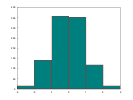
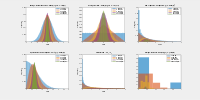

# Histogram

```cpp
hist(data);
```


See result
    
[](../../../examples/data_distribution/histogram/histogram_1.cpp)

More examples:
    
[](../../../examples/data_distribution/histogram/histogram_2.cpp)  [](../../../examples/data_distribution/histogram/histogram_3.cpp)  [](../../../examples/data_distribution/histogram/histogram_4.cpp)  [](../../../examples/data_distribution/histogram/histogram_5.cpp)  [](../../../examples/data_distribution/histogram/histogram_6.cpp)  [](../../../examples/data_distribution/histogram/histogram_7.cpp)  [](../../../examples/data_distribution/histogram/histogram_8.cpp)  [](../../../examples/data_distribution/histogram/histogram_9.cpp)  [](../../../examples/data_distribution/histogram/histogram_10.cpp)  [](../../../examples/data_distribution/histogram/histogram_11.cpp)  [](../../../examples/data_distribution/histogram/histogram_12.cpp)  [](../../../examples/data_distribution/histogram/histogram_14.cpp)
  

The `histogram` object creates the histogram edges and bins when the `draw` function is called for the first time with lazy evaluation. Lazy evaluation avoids calculating edges unnecessarily in case the user changes the object parameters before calling `draw`. This object includes several algorithms for automatically delimiting the edges and bins for the histograms. 


