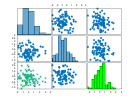

# Plot Matrix

```cpp
plotmatrix(X);
```


See result
    
[](https://github.com/alandefreitas/matplotplusplus/blob/master/examples/data_distribution/plotmatrix/plotmatrix_1.cpp)

More examples:
    
[](https://github.com/alandefreitas/matplotplusplus/blob/master/examples/data_distribution/plotmatrix/plotmatrix_2.cpp)  [](https://github.com/alandefreitas/matplotplusplus/blob/master/examples/data_distribution/plotmatrix/plotmatrix_3.cpp)  [](https://github.com/alandefreitas/matplotplusplus/blob/master/examples/data_distribution/plotmatrix/plotmatrix_4.cpp)


The Plot Matrix subcategory is a combination of histograms and scatter plots. It creates a matrix of `axes` objects on the `figure` and creates a scatter plot for each pair of data sets.
 


<!-- Generated with mdsplit: https://github.com/alandefreitas/mdsplit -->
