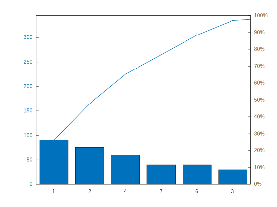

# Pareto Chart

```cpp
pareto(y);
```


See result

[](https://github.com/alandefreitas/matplotplusplus/blob/master/examples/discrete_data/pareto/pareto_1.cpp)

More examples:
    
[](https://github.com/alandefreitas/matplotplusplus/blob/master/examples/discrete_data/pareto/pareto_2.cpp)  [](https://github.com/alandefreitas/matplotplusplus/blob/master/examples/discrete_data/pareto/pareto_3.cpp) [](https://github.com/alandefreitas/matplotplusplus/blob/master/examples/discrete_data/pareto/pareto_4.cpp)


Pareto Charts are a type of chart that uses both $y$ axes. The $y_1$ axis is used to represent bars with the data values in descending order. The $y_2$ axis is used to represent the cumulative distribution function of the data in the $y_1$ axis. By default, a Pareto Chart includes up to 10 items or as many items as needed to represent 95% of the cumulative distribution.

If you need Pareto *fronts* rather than Pareto *charts*, we refer to [Scatter Plots](../data-distribution/scatter-plot.md) for two-dimensional fronts, [Plot matrices](../data-distribution/plot-matrix.md) for three-dimensional fronts, or [Parallel Coordinate Plots](../data-distribution/parallel-coordinates.md) for many-objective fronts. These plot subcategories are described in Section [Data Distribution](../data-distribution.md). If you also need a tool to calculate these fronts efficiently, we refer to the [Pareto Front Library](https://github.com/alandefreitas/pareto-front).


<!-- Generated with mdsplit: https://github.com/alandefreitas/mdsplit -->
