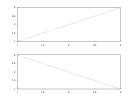
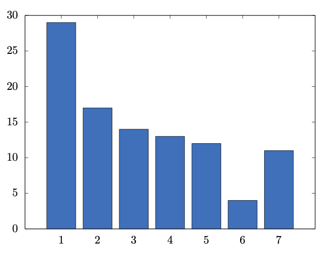

# Saving (Programatically)

You can programatically save the figure in a number of formats with the `save` function:

```cpp
save(filename);
```

or

```cpp
save(filename, fileformat);
```


See result
    
[](../../../examples/exporting/save/save_1.cpp)

More examples:
    
[](../../../examples/exporting/save/save_2.cpp)  [](../../../examples/exporting/save/save_3.cpp)  [](../../../examples/exporting/save/save_4.cpp)  [](../../../examples/exporting/save/save_5.cpp)  [](../../../examples/exporting/save/save_6.cpp)  [](../../../examples/exporting/save/save_7.cpp)  [](../../../examples/exporting/save/save_8.cpp)
 

The first option (`save(filename)`) infers the appropriate file format from the filename extension. In both cases (`save(filename)` and `save(filename,fileformat)`), this function temporarily changes the backend to a non-interactive backend appropriate to draw the figure. A different backend is used for each format and, depending on the format, the final image does not necessarily match what is on the interactive plot window. The reason is that some file formats purposefully do not include the same features.

 For instance, consider the bar chart generated by
 
 ```cpp
 vector<double> x = {29, 17, 14, 13, 12, 4, 11};
 bar(x);
 ```
 
 If we export the image with
 
 ```cpp
 save("barchart.svg");
 ```
 
 we get the vector graphics 


See result

 

 
 Exporting the image with
 
 ```cpp
 save("barchart.txt");
 ```
 
 generates a representation of the image appropriate for text or markdown files, such as
 
 
See result

 
 ```
 
        30 +-----------------------------------------------------------+
           |    *******   +       +      +       +      +       +      |
           |    *     *                                                |
        25 |-+  *     *                                              +-|
           |    *     *                                                |
           |    *     *                                                |
        20 |-+  *     *                                              +-|
           |    *     *                                                |
           |    *     ********                                         |
        15 |-+  *     **     *                                       +-|
           |    *     **     * *******                                 |
           |    *     **     * *     ******** *******                  |
           |    *     **     * *     **     * *     *        *******   |
        10 |-+  *     **     * *     **     * *     *        *     * +-|
           |    *     **     * *     **     * *     *        *     *   |
           |    *     **     * *     **     * *     *        *     *   |
         5 |-+  *     **     * *     **     * *     ******** *     * +-|
           |    *     **     * *     **     * *     **     * *     *   |
           |    *  +  **  +  * *  +  **  +  * *  +  **  +  * *  +  *   |
         0 +-----------------------------------------------------------+
                   1      2       3      4       5      6       7
 
 ```
 
 
 As the last example, saving an image with
 
 ```cpp
 save("barchart.tex");
 ```
 
 would save the image in a format appropriate to embed in latex documents, such as
  

See result

  

  
 This exports the image in a format in which the labels are replaced by latex text so that the plot fits the rest of the document.


