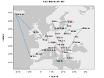

# Geoplot

```cpp
geoplot(lat,lon);
```


See result

[](https://github.com/alandefreitas/matplotplusplus/blob/master/examples/geography/geoplot/geoplot_1.cpp)

More examples:
    
[](https://github.com/alandefreitas/matplotplusplus/blob/master/examples/geography/geoplot/geoplot_2.cpp)  [](https://github.com/alandefreitas/matplotplusplus/blob/master/examples/geography/geoplot/geoplot_3.cpp)  [](https://github.com/alandefreitas/matplotplusplus/blob/master/examples/geography/geoplot/geoplot_4.cpp)  [](https://github.com/alandefreitas/matplotplusplus/blob/master/examples/geography/geoplot/geoplot_5.cpp)  [](https://github.com/alandefreitas/matplotplusplus/blob/master/examples/geography/geoplot/geoplot_6.cpp)  [](https://github.com/alandefreitas/matplotplusplus/blob/master/examples/geography/geoplot/geoplot_7.cpp)
  

For the first geography plot, **Matplot++** calls `geoplot()`, which creates a filled polygon with the world map. This first plot receives the tag `"map"` so that subsequent geography plots recognize there is no need to recreate this world map.

The data for the world map comes from Natural Earth. They provide data at 1:10m, 1:50m, and 1:110m scales. The `geoplot` function will initially use the data at the 1:110m scales. The `geolimits` function can be used to update the axis limits for geography plots. The difference between the usual functions for adjusting axis limits (`xlim` and `ylim`) and `geolimits` is that the latter will also update the map resolution according to the new limits for the $x$ and $y$ axis.

The `geolimits` function will query the `figure` size and, depending on the new limits for the axes, update the map to the 1:10m, or 1:50m scales if needed. Because it would be very inefficient to render the whole world map at a 1:10m or 1:50m scale only to display a region of this map, the `geolimits` function also crops the data pertinent to the new region being displayed.

Note that this does not only involve removing data points outside the new limits but it also needs to create new data points on the correct borders to create new polygons coherent with the map entry points in the region. For this reason, the algorithm needs to track all submaps represented as closed polygons in the original world map. If submaps are completely inside or outside the new ranges, we can respectively include or dismiss the data points. However, if the submap is only partially inside the new limits, to generate the correct borders for the polygons, we need to track all points outside the limits to classify the directions of these points outside the limits. We do that by only including points that change quadrants around the new limits so that the map entry points create polygons that look like they would if the complete world map were still being rendered outside these new limits.

If the you are not interested in geographic plots, the build script includes an option to remove the high-resolution maps at 1:10m and 1:50m scales from the library. In this case, the library will always use the map at a 1:110m scale no matter the axis limits.

The function `world_cities` returns a list of major world cities. Its parameters define the minimum distances between cities in the $x$ and $y$ axes. The `greedy_tsp` function is a naive greedy algorithm to find a route between these cities as a Traveling Salesman Problem (TSP). We use the `geoplot` function to draw this route. Note that we use method chaining to define some further plot properties. Finally, the `text` function includes the city names in the map.


