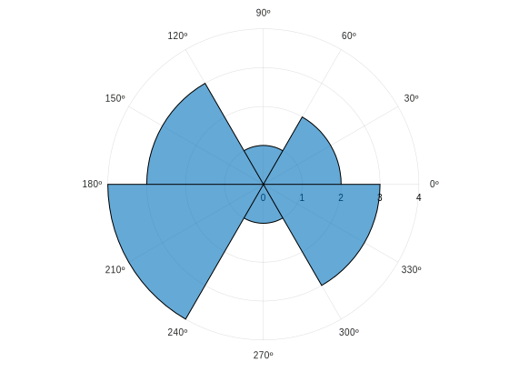

# Polar Histogram

```cpp
polarhistogram(theta, 6);
```


See result

[](../../../examples/polar_plots/polarhistogram/polarhistogram_1.cpp)

More examples:
    
[](../../../examples/polar_plots/polarhistogram/polarhistogram_2.cpp)  [](../../../examples/polar_plots/polarhistogram/polarhistogram_3.cpp)  [](../../../examples/polar_plots/polarhistogram/polarhistogram_4.cpp)  [](../../../examples/polar_plots/polarhistogram/polarhistogram_5.cpp)
  

The function `polarhistogram` distributes the data into the number of bins provided as its second parameter.
  


