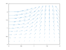

# Quiver

```cpp
quiver(x, y, u, v);
```


See result

[](https://github.com/alandefreitas/matplotplusplus/blob/master/examples/vector_fields/quiver/quiver_1.cpp)

More examples:
    
[](https://github.com/alandefreitas/matplotplusplus/blob/master/examples/vector_fields/quiver/quiver_2.cpp)  [](https://github.com/alandefreitas/matplotplusplus/blob/master/examples/vector_fields/quiver/quiver_3.cpp)  [](https://github.com/alandefreitas/matplotplusplus/blob/master/examples/vector_fields/quiver/quiver_4.cpp)


All these subcategories depend on the `vectors` object type. In a two-dimensional plot, for each value of $x$ and $y$ with the position of a vector, it also requires the value of $u$ and $v$ indicating its direction and magnitude. In a three-dimensional plot, the direction and magnitude are defined by $u$, $v$, and $w$.


A quiver plot (or velocity plot) shows a grid of vectors whose direction and magnitude are scaled to prevent the overlap between vectors in subsequent quads. 


<!-- Generated with mdsplit: https://github.com/alandefreitas/mdsplit -->
